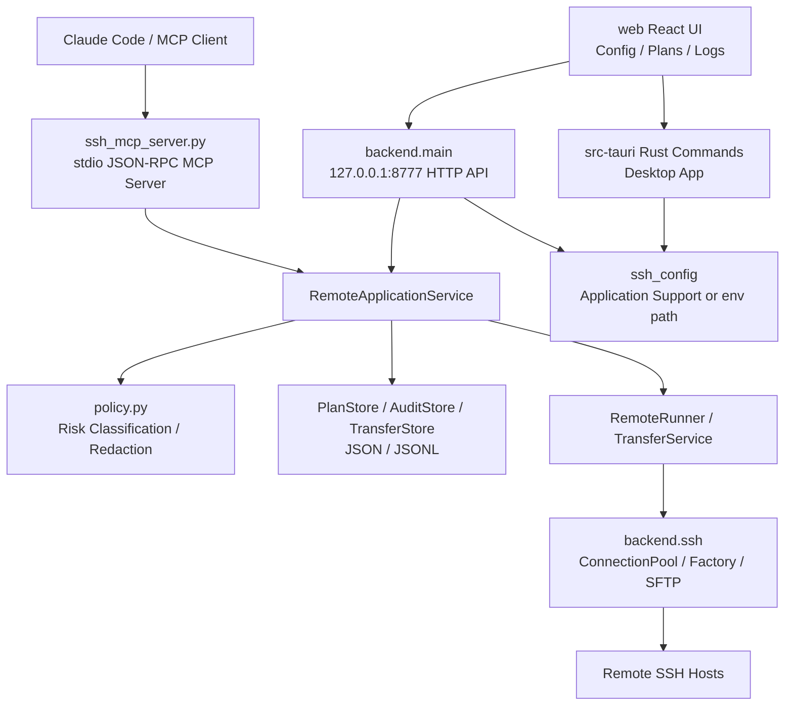
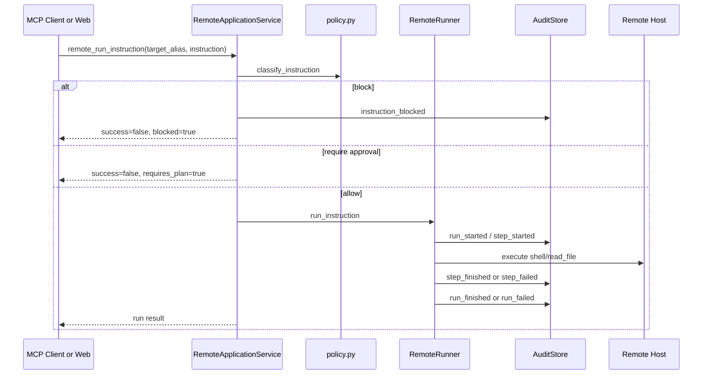
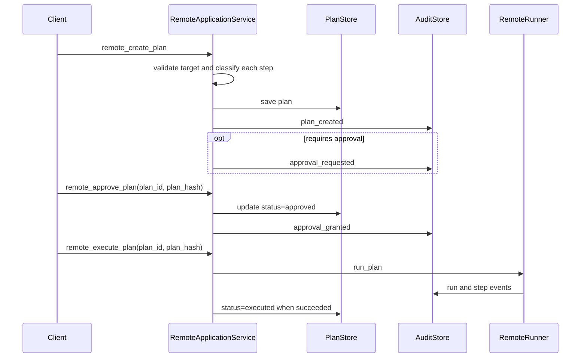

# Remote SSH MCP 架构文档

## 1. 项目定位

Remote SSH MCP 是一个面向 AI/Claude Code 的远程 SSH 操作工具集，核心目标是在执行远程命令、读写文件、上传文件前引入可审计的安全工作流。

当前项目由四个主要部分组成：

| 部分 | 目录/入口 | 主要职责 |
|---|---|---|
| MCP Server | `ssh_mcp_server.py` | 通过 stdio/JSON-RPC 暴露 MCP tools，供 Claude Code 调用 |
| Python HTTP API | `backend/main.py` | 为 Web UI 提供 SSH 配置、计划、审计查询等 HTTP API |
| 远程操作核心 | `backend/remote/`, `backend/ssh/` | Plan/Approval/Audit、风险策略、SSH 连接池、命令执行、SFTP 上传 |
| 桌面/Web UI | `web/`, `src-tauri/` | SSH 配置管理、计划审批、日志查看，Tauri 提供原生桌面壳 |

## 2. 总体架构



### 两条入口链路

1. MCP 链路：Claude Code 调用 `ssh_mcp_server.py` 暴露的 MCP tools，MCP Server 负责 JSON-RPC 协议处理、工具列表、工具分发和 MCP 调用审计。
2. UI 链路：React 页面调用本地 HTTP API 或 Tauri commands。配置 CRUD 在 Tauri 运行时走 Rust invoke，在开发模式走 Python HTTP API；计划/审计功能走 Python HTTP API。

## 3. 目录结构

```text
.
├── ssh_mcp_server.py              # MCP stdio server 入口
├── backend/
│   ├── main.py                    # 本地 HTTP API
│   ├── paths.py                   # 应用数据目录、配置路径
│   ├── models.py                  # SSH 配置 payload 模型
│   ├── ssh_config_service.py      # ssh_config 文件 CRUD
│   ├── connection_test.py         # Python 侧连接测试
│   ├── remote/
│   │   ├── service.py             # 远程操作应用服务，主要编排层
│   │   ├── models.py              # Instruction / Plan / Audit / Run 数据模型
│   │   ├── policy.py              # 风险分类、预览、脱敏
│   │   ├── runner.py              # 同步执行 plan 或低风险单指令
│   │   ├── plan_store.py          # plans.json 持久化
│   │   ├── audit_store.py         # audit.jsonl 持久化
│   │   ├── mcp_audit.py           # MCP tool 调用级审计
│   │   ├── transfer_*.py          # 后台上传任务、进度、取消、持久化
│   │   └── upload_utils.py        # 上传校验、备份、原子替换等工具
│   └── ssh/
│       ├── models.py              # SSH target、pool config、连接错误
│       ├── factory.py             # paramiko SSHClient 创建，支持 jump host 模型
│       ├── pool.py                # 线程安全 SSH 连接池
│       ├── sftp.py                # SFTP 上传、下载、远端 hash、存在性检查
│       └── executor.py            # SSH 命令执行辅助
├── web/
│   └── src/
│       ├── App.tsx                # HashRouter 页面路由
│       ├── api/                   # HTTP API 和 Tauri invoke 封装
│       ├── pages/                 # ConfigEditor / Plans / Logs
│       └── components/            # 布局、计划卡片、详情弹窗等
├── src-tauri/
│   └── src/
│       ├── lib.rs                 # Tauri command 注册
│       ├── main.rs                # 桌面应用入口
│       └── ssh_config.rs          # Rust 侧 ssh_config CRUD 和连接测试
├── skills/remote-ssh/SKILL.md     # Claude Code Skill
└── docs/                          # 设计和架构文档
```

## 4. 核心模块职责

### 4.1 MCP Server

`ssh_mcp_server.py` 是一个轻量协议适配层：

- 读取 MCP stdio 消息，兼容 `Content-Length` 和 JSONL 两种写出模式。
- 响应 `initialize`、`tools/list`、`tools/call`、`ping`。
- 注册 `remote_*` tools 以及部分 `ssh_*` 兼容别名。
- 每次工具调用前后通过 `backend.remote.mcp_audit` 记录 `mcp_call_started`、`mcp_call_finished`、`mcp_call_failed`。
- 将实际业务转发到单例 `RemoteApplicationService`。

### 4.2 RemoteApplicationService

`backend/remote/service.py` 是远程操作的应用服务层，负责：

- 从 `ssh_config_service` 解析 target。
- 创建、审批、拒绝、执行计划。
- 执行低风险单指令。
- 查询审计日志。
- 创建和查询后台上传任务。
- 统一返回 MCP/HTTP 可序列化字典。

该层不直接操作 paramiko，而是把执行交给 `RemoteRunner` 或 `TransferService`。

### 4.3 Policy

`backend/remote/policy.py` 对指令做风险分类：

| 指令类型 | 当前策略 |
|---|---|
| `shell` | 空命令阻断；敏感路径阻断；复杂 shell 操作符需审批；只读 allowlist 可直接执行；未知命令需审批 |
| `read_file` | 普通文件允许，敏感路径阻断 |
| `write_file` | 需要审批 |
| `sftp_put` | 高风险，需要审批 |
| `sftp_get` | 普通下载允许，敏感路径下载需审批 |
| `interactive` | 高风险，需要审批 |

同一模块也负责输出预览文本和敏感信息脱敏，包括 password/token/secret/api key、私钥文本、公网 IPv4、自定义 redaction patterns。

### 4.4 Runner

`backend/remote/runner.py` 负责同步执行：

- `run_instruction`：把直接低风险指令包装成临时单步计划。
- `run_plan`：顺序执行计划步骤，任何步骤失败会终止整个 run。
- `shell`：通过系统 `ssh` 命令执行，目前要求 key auth。
- `read_file`：转换为 `cat -- <remote_path>` 执行。
- `sftp_put`：通过连接池和 SFTP 上传，支持冲突策略、原子替换、校验、备份和回滚。

执行结果写入审计事件，stdout/stderr 会计算 sha256 digest，并保存最多 8192 bytes 的脱敏摘要。

### 4.5 SSH 层

`backend/ssh/` 封装 SSH 连接能力：

- `ConnectionTarget`：目标主机模型，包含 alias、hostname、port、username、auth、identity file、jump host 等。
- `SSHConnectionFactory`：创建 paramiko client，设置 keepalive，支持直接连接和 jump host 连接模型。
- `SSHConnectionPool`：按 target key 分桶，支持 core/max 连接、每连接 channel 上限、idle 清理、健康检查和 shutdown。
- `sftp.py`：封装 SFTP 上传/下载、远端 hash、远端文件存在性检查。

注意：MCP 同步命令执行当前走系统 `ssh` 命令；SFTP 上传走 paramiko 连接池。

### 4.6 HTTP API

`backend/main.py` 用 Python 标准库 `ThreadingHTTPServer` 提供本地 API：

- `GET /api/health`
- `GET/POST/PUT/DELETE /api/ssh-configs`
- `POST /api/ssh-configs/test`
- `GET /api/remote/targets`
- `GET /api/remote/capabilities`
- `GET/POST /api/remote/plans`
- `GET /api/remote/plans/{plan_id}`
- `POST /api/remote/plans/{plan_id}/approve`
- `POST /api/remote/plans/{plan_id}/reject`
- `POST /api/remote/plans/{plan_id}/execute`
- `GET /api/remote/audit-events`
- `POST /mcp`，用于 Web 侧通过 HTTP 形式复用 MCP tool dispatch。

### 4.7 Web 和 Tauri

Web UI 使用 React 19、Vite、Tailwind、shadcn/ui：

- `ConfigEditor`：管理 SSH Host 配置。
- `Plans`：查看、审批、拒绝、执行计划。
- `Logs`：查看审计事件。

Tauri 2 的 Rust 层提供：

- `get_ssh_config_path`
- `list_ssh_configs`
- `get_ssh_config`
- `create_ssh_config`
- `update_ssh_config`
- `delete_ssh_config`
- `test_ssh_connection`

Rust 侧配置读写逻辑与 Python `ssh_config_service.py` 基本对齐：解析 `Host` block，写入前生成备份，并把 `Workdir`、`Remarks` 存为注释。

## 5. 关键业务流程

### 5.1 低风险指令直接执行



### 5.2 审批计划执行



### 5.3 后台上传任务

后台上传是针对已审批计划中的 `sftp_put` 步骤：

1. `remote_start_transfer` 校验计划状态必须为 `approved`，校验 `plan_hash`、`step_id`、本地文件和远端路径。
2. `TransferStore.create_upload` 创建 `TransferRecord`，记录大小、路径、原子上传临时路径等。
3. `TransferWorker` 在线程池中执行上传。
4. 上传过程持续更新进度、速度和 ETA。
5. 支持 `remote_get_transfer` 轮询状态，`remote_cancel_transfer` 请求取消。
6. 成功后进入 verify、rename、succeeded；失败时写入失败状态和审计事件。

并发限制当前为：

- 全局最多 2 个运行中传输。
- 单 target 最多 1 个运行中传输。

## 6. 数据模型

核心 dataclass 位于 `backend/remote/models.py`：

| 模型 | 说明 |
|---|---|
| `Instruction` | 单个远程操作，包含 kind、command、路径、内容、上传策略、超时、脱敏规则等 |
| `PlanStep` | 计划步骤，包含指令、预期效果、回滚提示、风险等级 |
| `ExecutionPlan` | 可审批计划，包含状态、风险、过期时间、审批信息、plan_hash |
| `ExecutionRun` | 一次执行过程，包含 run id、当前步骤、步骤结果 |
| `StepResult` | 单步执行结果，包含状态、退出码、输出摘要、错误和 metadata |
| `AuditEvent` | 审计事件，覆盖 MCP 调用、计划、审批、运行、步骤、阻断等 |
| `PolicyResult` | 风险策略判断结果 |

后台传输模型位于 `backend/remote/transfer_models.py`：

| 模型 | 说明 |
|---|---|
| `TransferRecord` | 上传任务状态、路径、字节数、速度、ETA、hash、取消标记、错误信息 |
| `TransferStatus` | pending/running/verifying/renaming/succeeded/failed/cancelled/timed_out/conflict 等 |

## 7. 持久化和配置

路径由 `backend/paths.py` 决定：

- macOS 默认目录：`~/Library/Application Support/Remote SSH MCP`
- SSH 配置：`REMOTE_SSH_MCP_CONFIG_PATH` 或默认 `.../ssh_config`
- 数据目录：`REMOTE_SSH_MCP_DATA_DIR` 或默认 `.../data`

当前持久化文件：

| 文件 | 写入方 | 内容 |
|---|---|---|
| `ssh_config` | Python HTTP API / Tauri Rust commands | SSH Host 配置，不保存密码 |
| `ssh_config.bak` | Python / Rust 写配置前备份 | 上一版配置 |
| `data/plans.json` | `PlanStore` | 执行计划列表 |
| `data/audit.jsonl` | `AuditStore` | 追加式审计事件 |
| transfer store 文件 | `TransferStore` | 后台传输任务记录 |

## 8. 安全边界

项目当前的主要安全机制：

- 用户输入入口做校验：SSH payload、instruction kind、timeout、mode、conflict policy、路径等。
- 策略层阻断敏感路径读取和敏感 shell 命令引用。
- 中高风险操作必须创建计划并审批后执行。
- `plan_hash` 可用于审批/执行时校验计划内容未变化。
- 审计日志写入前递归脱敏。
- 上传支持 atomic temp path、hash verify、备份和失败恢复。
- UI/Tauri 配置写入不会持久化密码。

需要注意的边界：

- `SSHConnectionFactory` 使用 `AutoAddPolicy`，会自动信任未知 host key。
- 同步 shell 执行要求 key auth，密码 auth 目前主要用于配置和 TCP 测试。
- Python 和 Rust 各自实现了一份 `ssh_config` 解析/写入逻辑，长期需要保持一致。
- `backend/main.py` 默认监听 `127.0.0.1:8777`，没有认证层，设计上应只用于本机。

## 9. 开发和运行

### MCP Server

```bash
python3 -m venv .venv
source .venv/bin/activate
pip install -r requirements.txt
python ssh_mcp_server.py
```

### Python HTTP API

```bash
.venv/bin/python -m backend.main
```

### Web UI

```bash
cd web
pnpm install
pnpm dev
```

### Desktop App

```bash
cd web
pnpm tauri:dev
```

## 10. 当前架构约束和后续演进建议

1. `RemoteApplicationService` 是当前主要编排点，已经接近 500 行；后续可按 plan、audit、transfer、target resolver 拆分 service。
2. `RemoteRunner` 当前 600 行，且包含 shell、read_file、sftp_put 多种执行逻辑；后续可拆成 `executors/` 下的 kind-specific executor。
3. `ConfigEditor.tsx` 当前超过项目建议的 React 单文件 500 行限制，后续改 UI 时建议拆出 form、list、test dialog 等子组件。
4. `ssh_config` CRUD 在 Python 和 Rust 双实现，建议提炼共享测试用例，至少用 fixture 保证解析和写出行为一致。
5. 计划、审计、传输使用本地文件持久化，适合单机桌面场景；如果未来支持多进程并发或服务化部署，需要引入文件锁或更明确的存储层。
6. `sftp_get`、`write_file`、`interactive` 在模型和策略中已存在，但同步 runner 侧尚未完整实现，需要在文档或能力返回中继续保持真实状态。
