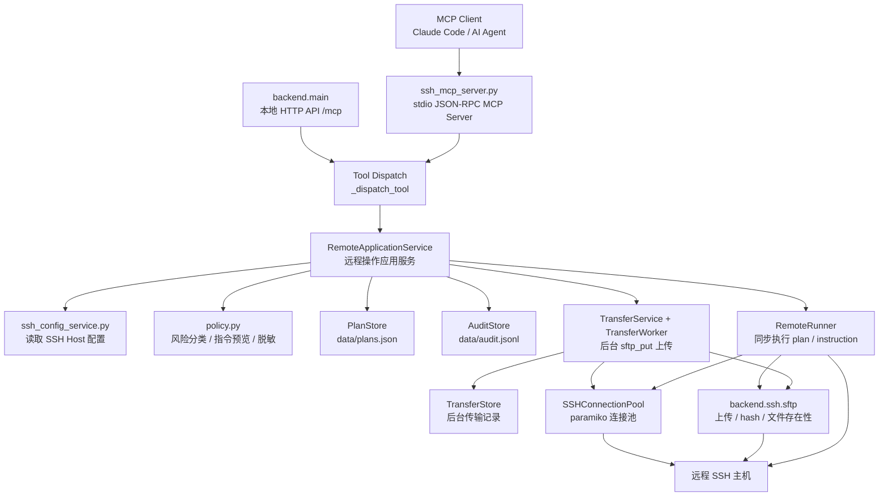
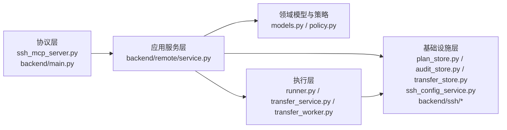
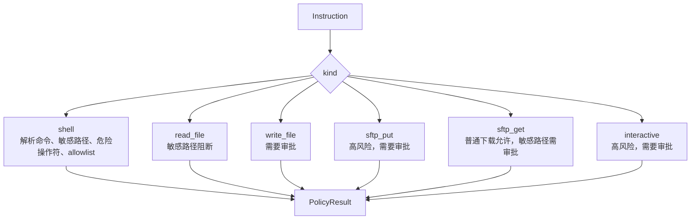
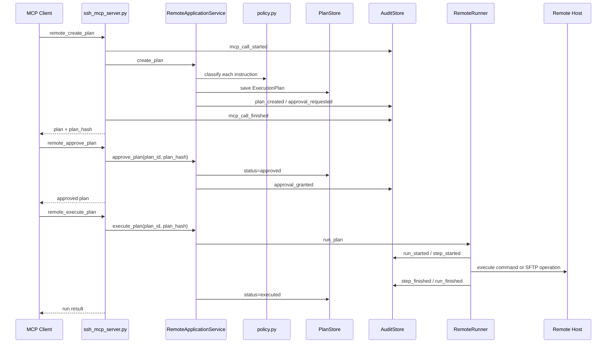
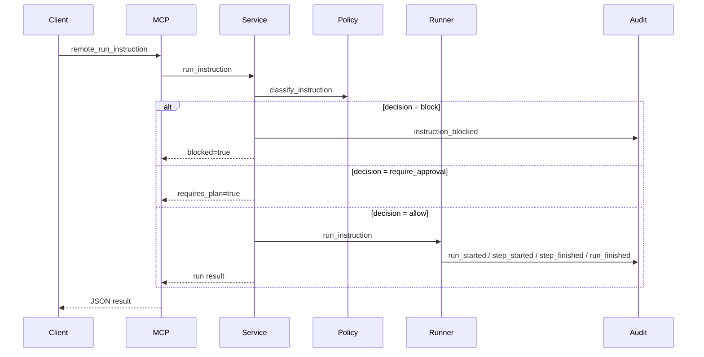
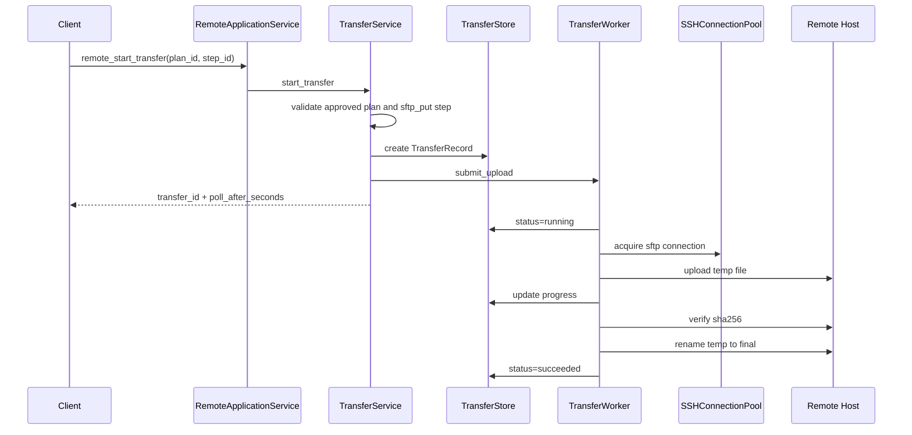
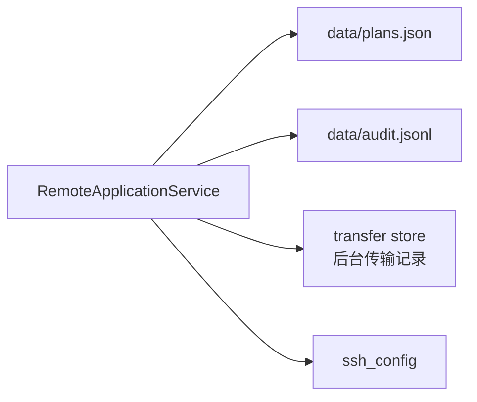
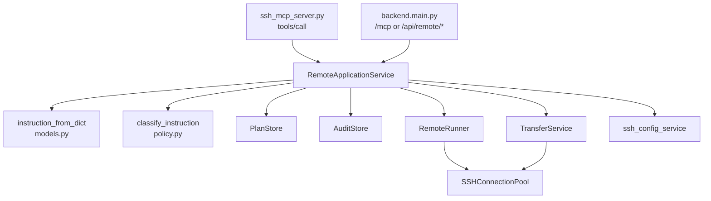

# MCP 与 Python 后端架构图说明

本文聚焦当前项目中的 MCP Server 和 Python 代码结构，不覆盖 React/Tauri 前端实现细节。

## 1. 架构总览

当前 Python 侧有两个入口：

| 入口 | 文件 | 协议 | 用途 |
|---|---|---|---|
| MCP stdio 入口 | `ssh_mcp_server.py` | MCP JSON-RPC over stdio | 给 Claude Code 等 MCP Client 调用 |
| 本地 HTTP 入口 | `backend/main.py` | HTTP + JSON | 给 Web UI/桌面开发模式调用，也提供 `/mcp` 复用 MCP tool dispatch |

两条入口最终都会调用 `RemoteApplicationService`，因此计划、审批、执行、审计的核心行为保持一致。

## 2. MCP Server 代码结构

`ssh_mcp_server.py` 是一个薄协议层，职责包括：

1. 读取请求：`_read_message()` 支持 `Content-Length` 格式，也兼容 JSONL。
2. 写出响应：`_write_message()` 根据输入模式输出 MCP 响应。
3. 处理基础 MCP 方法：`initialize`、`ping`、`tools/list`、`tools/call`。
4. 暴露工具定义：`_tools()` 返回 MCP tools schema。
5. 分发工具调用：`_dispatch_tool()` 把工具名和参数转给 `RemoteApplicationService`。
6. 记录 MCP 调用审计：每次 `tools/call` 会写入 started/finished/failed 事件。

### MCP tools 分组

| 分组 | Tools | 说明 |
|---|---|---|
| Target 查询 | `remote_list_targets` | 列出可用 SSH Host，不暴露凭据 |
| 能力查询 | `remote_get_capabilities` | 返回指令类型、策略和限制 |
| 指令预览 | `remote_preview_instruction` | 不执行，只返回预览和风险判断 |
| Plan 工作流 | `remote_create_plan`, `remote_list_plans`, `remote_get_plan`, `remote_approve_plan`, `remote_reject_plan`, `remote_execute_plan` | 创建、审批、拒绝、执行计划 |
| 直接执行 | `remote_run_instruction` | 仅允许策略判断为低风险的单指令直接执行 |
| 审计查询 | `remote_list_audit_events` | 查询审计日志 |
| 后台传输 | `remote_start_transfer`, `remote_get_transfer`, `remote_cancel_transfer`, `remote_list_transfers` | 针对已审批 `sftp_put` 步骤的后台上传 |
| 兼容别名 | `ssh_list_plans`, `ssh_get_plan`, `ssh_approve_plan`, `ssh_reject_plan`, `ssh_execute_plan`, `ssh_read_audit_log` | 保持旧命名兼容 |

## 3. Python 后端分层

### 3.1 协议层

| 文件 | 责任 |
|---|---|
| `ssh_mcp_server.py` | MCP stdio server，负责 JSON-RPC、tools schema、tools/call 分发 |
| `backend/main.py` | 本地 HTTP API，提供 SSH 配置 CRUD、计划/审计 API，以及 `/mcp` JSON-RPC 兼容入口 |

协议层只做参数读取、响应包装、错误转换和调用审计，不直接执行业务。

### 3.2 应用服务层

核心文件：`backend/remote/service.py`

`RemoteApplicationService` 是 Python 后端的主编排类：

- `list_targets()`：从 `ssh_config` 返回 target 列表，并隐藏敏感 host 信息。
- `preview_instruction()`：解析指令并返回策略结果。
- `create_plan()`：生成计划、步骤、风险等级、plan hash，并写入审计。
- `approve_plan()` / `reject_plan()`：修改计划状态并写入审批审计。
- `execute_plan()`：校验 hash、过期时间和审批状态后交给 `RemoteRunner`。
- `run_instruction()`：只允许低风险单指令直接执行。
- `start_transfer()` / `get_transfer()` / `cancel_transfer()`：委托后台传输服务。
- `list_audit_events()`：查询审计事件。

### 3.3 领域模型与策略层

核心文件：

- `backend/remote/models.py`
- `backend/remote/policy.py`

主要模型：

| 模型 | 说明 |
|---|---|
| `Instruction` | 远程操作指令，支持 shell、read_file、write_file、sftp_put、sftp_get、interactive |
| `PlanStep` | 计划步骤，绑定一个 instruction、风险等级、预期效果和回滚提示 |
| `ExecutionPlan` | 执行计划，包含状态、审批信息、过期时间和 `plan_hash` |
| `ExecutionRun` | 一次执行实例 |
| `StepResult` | 单步骤执行结果 |
| `AuditEvent` | 审计事件 |
| `PolicyResult` | 策略判断结果：allow、require_approval、block |

风险策略：

### 3.4 执行层

核心文件：

- `backend/remote/runner.py`
- `backend/remote/transfer_service.py`
- `backend/remote/transfer_worker.py`
- `backend/remote/upload_utils.py`

`RemoteRunner` 负责同步执行：

- 低风险单指令会被包装为临时单步计划。
- 计划按步骤顺序执行。
- 任一步骤失败后，整个 run 失败并停止后续步骤。
- `shell` 使用系统 `ssh` 命令执行，目前要求 key auth。
- `read_file` 转换为 `cat -- <remote_path>`。
- `sftp_put` 走 paramiko SFTP，支持冲突策略、备份、原子替换和 sha256 校验。

`TransferService` 和 `TransferWorker` 负责后台上传：

- 只允许启动已审批计划中的 `sftp_put` 步骤。
- 创建 `TransferRecord` 后立即返回 `transfer_id`。
- 后台线程执行上传，前端或 MCP Client 可轮询进度。
- 支持取消 pending/running 上传，但 verifying/renaming 阶段不可取消。

### 3.5 基础设施层

| 文件 | 责任 |
|---|---|
| `backend/paths.py` | 统一计算应用配置路径和数据目录 |
| `backend/ssh_config_service.py` | 解析和写入 `ssh_config` Host block |
| `backend/remote/plan_store.py` | 用 JSON 文件保存计划 |
| `backend/remote/audit_store.py` | 用 JSONL 追加保存审计事件 |
| `backend/remote/transfer_store.py` | 保存后台传输状态 |
| `backend/ssh/models.py` | SSH target、连接池配置、错误类型 |
| `backend/ssh/factory.py` | 创建 paramiko SSHClient |
| `backend/ssh/pool.py` | 线程安全 SSH 连接池 |
| `backend/ssh/sftp.py` | SFTP 上传下载、远端 hash、文件存在性检查 |

## 4. Plan / Approval / Audit 工作流

关键控制点：

- 创建计划时会计算每个 instruction 的风险。
- `block` 类型指令不会进入计划，会写 `instruction_blocked` 审计。
- 需要审批的计划状态为 `pending_approval`。
- 执行时可传 `plan_hash`，用于确认执行的是同一份计划内容。
- 计划过期后不能审批或执行，并会写 `plan_expired` 审计。

## 5. 低风险直接执行流程

这条路径只适合只读或低风险操作，例如 `pwd`、`whoami`、`df`、`tail`、`grep` 等 allowlist 命令。未知命令、复杂 shell 操作符、修改型命令都会要求先创建计划。

## 6. 后台上传流程

上传保护能力：

- 本地文件校验和大小限制。
- 远端路径校验。
- 冲突策略：`fail`、`overwrite`、`backup_then_overwrite`、`rename_new`。
- 原子上传：先上传临时文件，再 rename 到目标路径。
- 可选 chmod。
- sha256 校验。
- 失败时清理临时文件，必要时恢复备份。

## 7. 数据存储

默认路径由 `backend/paths.py` 控制：

- `REMOTE_SSH_MCP_CONFIG_PATH`：覆盖 SSH 配置文件路径。
- `REMOTE_SSH_MCP_DATA_DIR`：覆盖数据目录。
- macOS 默认目录：`~/Library/Application Support/Remote SSH MCP`。

存储格式：

| 数据 | 默认文件 | 格式 | 说明 |
|---|---|---|---|
| SSH Host 配置 | `ssh_config` | OpenSSH config | Host block，密码不写入磁盘 |
| 执行计划 | `data/plans.json` | JSON array | 保存 `ExecutionPlan` |
| 审计事件 | `data/audit.jsonl` | JSONL | 每行一个 `AuditEvent`，追加写 |
| 传输任务 | TransferStore 文件 | JSON | 保存后台上传状态和进度 |

## 8. Python 代码调用关系

简化理解：

- MCP/HTTP 只管入口。
- `RemoteApplicationService` 负责编排。
- `models.py` 负责数据结构和序列化。
- `policy.py` 负责风险判断。
- `runner.py` 和 `transfer_worker.py` 负责真正执行。
- `plan_store.py`、`audit_store.py`、`transfer_store.py` 负责落盘。
- `backend/ssh/*` 负责 SSH/SFTP 基础能力。

## 9. 当前实现边界

1. `sftp_get`、`write_file`、`interactive` 已在模型和策略中定义，但同步 runner 侧尚未完整执行实现。
2. 同步 `shell` 执行当前使用系统 `ssh` 命令，并要求 key auth。
3. SFTP 上传走 paramiko 连接池。
4. 审计日志会脱敏，但 stdout/stderr 仍保留摘要文本，需要继续控制敏感命令的执行边界。
5. 本地 HTTP API 默认监听 `127.0.0.1:8777`，没有鉴权，适合作为本机桌面配套服务。
6. Python 文件持久化适合单进程/桌面使用场景，多进程并发写入需要额外文件锁或替换存储层。
